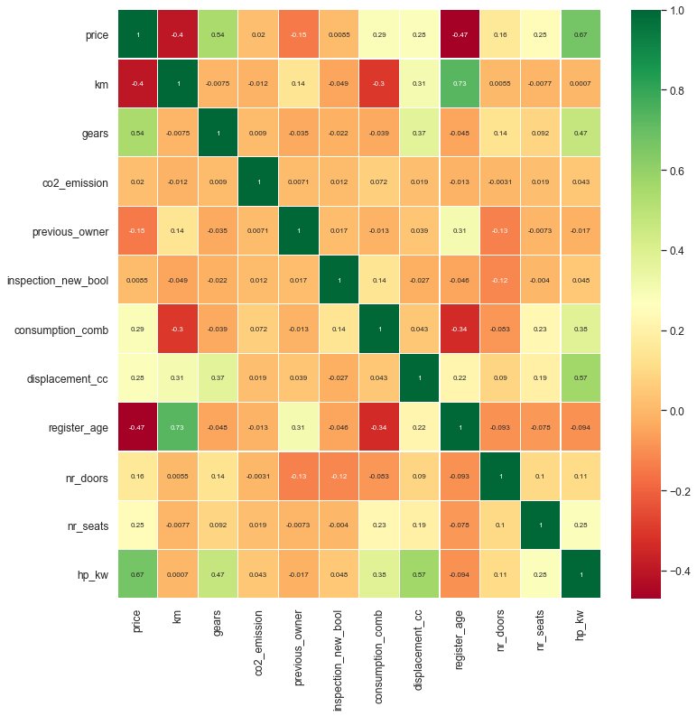

# Eda Project

## Descriptions :
- A ``.json`` file containing a dataset consisting of 15919 rows and 54 columns is provided.
- This dataset, scraped from the on-line car trading company in 2019, contains many features of 9 different car models.
- The features (variables) of this dataset are too messy and distored.

## What is expected of you?
- Read the ``.json`` file and assign the dataset into a ``DataFrame`` using ``pandas``.
- Implement all aspects of the **EDA process** to the dataset.
   - Fix corrupted data formats,
   - Handle with outliers and missing values,
      - Domain (automobiles) knowledge is important.
      - Always use the internet to do the research that you need.
      - Think carefully to decide whether a data is outliers or not. Examples :
         - There is no conventional car model with an average fuel consumption of 1 - 1.5 liters per 100 km. 
         - Or you need to know that it cannot be a 300 euro car. 
         - Or if there is only one car with 3 doors out of the 15919 cars, this is what you should pay attention to and examine.
   - Drop the columns / rows you determined unnecessary as a result of your analysis,
   - Use visualization tools while doing all these processes.
- As a result, get the dataset ready to provide an appropriate input to the ML models.
- Save cleaned dataset into a ``.csv`` file.

## Need to Study :
- ``.str.method``,
- ``.contains()``,
- ``.extract()``,
- ``.to_datetime()``,
- ``.get_dummies()``,
- ``.add_prefix()``,
- ``.sample()``,
- `regex`,
- ``.to_numeric()``,
- ``.isin()``,
- ``.corr()``.

## Load Data
```
oto = pd.read_json('scout_car.json', orient = 'records', lines = True)
```
## Examine our dataframe (oto)
```
oto.info()
```

##  Implement EDA Process to all columns

```
oto1.to_csv('scout_car_precleaned.csv', index = False)
```


## Handling with Missing Values & Outliers¶
```
def fill_most(group_col, col_name): 
    """
This function fills the missing values with the most frequent values groupby column 'group_col'.
For example : based on 'make_model' column, the function fill using .mode(), the most frequent value of variables.
     """
    for group in list(oto1[group_col].unique()):
        grp_inx=list(oto1[oto1[group_col]==group][col_name].index)
        oto1[col_name].iloc[grp_inx]=oto1[col_name].iloc[grp_inx].fillna(oto1[oto1[group_col]==group][col_name].mode()[0])
```

## Data Visualization

[]


## Correlation with Heatmap

[]


## Vat Distrubition

[]

## Outlier

[]


[]

## End of this Project

```
oto2.to_csv('scout_car_model.csv', index = False)

```

Next step will be :
Runing the Regression ML Model

